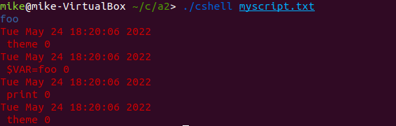

# Cshell


An implementation of a shell for linux written in C

## Usage  

make all to build  
make clean to clean

valid commands:

exit - exit cshell  
log - print a log of executed commands  
$ - create or use a variable, ex: <$var=hello> will create a variable named var holding "hello"   
print - print a string composed of variables and hardcoded text. Ex: <$var world!> prints "hello world!"   
theme - change the theme to a new text color, valid options are white, red, blue, and green  


### File Mode

In File mode you provide a .txt file that has a list of commands, one per line, to cshell   
Example:
```
//myscript.txt
theme blue
$VAR=foo
print $VAR
theme red
log
```
run: `./cshell myscript.txt`




### User Mode

To enter user mode just run cshell without parameters: `./cshell`  
and type commands one by one after


#### Future Additions

Make file mode and user mode both work with standard linux shell commands  like ls, whoami, etc 


